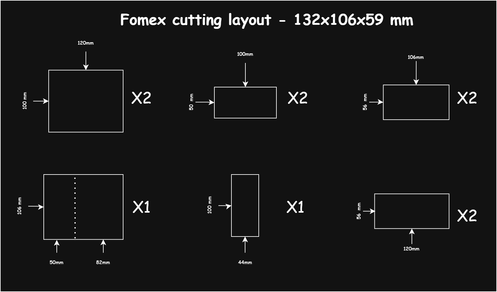

# 📦 The Emotional Useless Box
Một chiếc hộp vô dụng (Useless Box) nhưng có "tính cách" đa dạng, được điều khiển bằng mảng con trỏ hàm.

##  Giới thiệu
Dự án DIY Useless Box được thiết kế với cơ cấu thanh truyền (Push-Pull Linkage) cho phép nắp hộp đóng sập chủ động, kết hợp với các kịch bản phản hồi Ngaa để tạo ra nhiều trạng thái cảm xúc khác nhau.

##  Tính năng (Features)
- Cơ chế nắp chủ động bằng Servo độc lập.
- Led RGB hiển thị trạng thái cảm xúc
- Hệ thống trạng thái cảm xúc ngẫu nhiên (Bình thường, Tức giận, Rụt rè,...).

##  Linh kiện Phần cứng (Hardware Requirements)
- 1x Vi điều khiển (Arduino NANO).
- 2x Micro Servo SG90.
- 1x Công tắc gạt MTS 2 chế độ.
- 1x Pin 18650 + Mạch sạc TP4056.
- 1x Mạch tăng áp mini (cho Arduino).
- Vật liệu vỏ: Formex 3mm.

##  Bản vẽ Thiết kế Cơ khí

##  Hướng dẫn Cài đặt (Installation)
1. Clone repository này về máy.
2. Mở file `.ino` bằng Arduino IDE.
3. Đảm bảo đã cài đặt thư viện `Servo.h` (có sẵn trong IDE).
4. Nạp code vào mạch.

##  Lộ trình (TODO)
- [x] Thiết kế kích thước vỏ hộp Formex.
- [x] Đo và cắt Formex, tạo vỏ hôp.
- [x] Xử lý phần cứng: hàn và nối linh kiện.
- [x] Đưa linh kiện vào vỏ hộp và test các chức năng cơ bản.
- [x] Viết Sourcode cơ bản và test.
- [x] Hoàn thiện mảng các hàm (Function Pointers) cho kịch bản.

##  Hardware Setup & Troubleshooting
Trong quá trình thi công thực tế (cắt Formex, hàn mạch, đi dây), dự án đã gặp một số vấn đề vật lý và được xử lý bằng các kỹ thuật "hotfix" sau:

### 1. Vật liệu và thẩm mỹ: Độ bền vật liệu không đảm bảo
* **Vấn đề:** Khi cắt các miếng Formex theo bản thiết kế bản đầu, với miếng Formex 3mm thì phần đế 120x100mm trở nên quá mỏng manh, yếu ớt. Điều này cũng tương tự khi quan sát phần nắp gắn công tắc và 2 mặt bên trước-sau, nơi sẽ được lắp đặt các linh kiện.
* **Giải pháp:** Dán đè thêm 1 tấm Formex lên các vị trí yếu, nâng độ dày thành 6mm. Đồng thời thay đổi thiết kế hộp rộng hơn, cho các mặt bên phủ che đi vết cắt phần đế để tăng tính thẩm mỹ.

### 2. Cơ khí: Chống xoay công tắc MTS trên nền Formex
* **Vấn đề:** Bề mặt Formex xốp mềm, nếu chỉ vặn đai ốc, lực gạt công tắc liên tục sẽ làm củ công tắc bị xoay tròn. 
* **Giải pháp:** Áp dụng thứ tự lắp ráp ngược: `Vòng đệm răng cưa`  -> `Vòng đệm có ngàm phẳng` (mấu nhọn chĩa lên trên). Khi siết đai ốc, ngàm nhọn đâm và lún sâu vào Formex, tạo thành ngàm chống xoay hoàn hảo.

### 3 Cứu hộ Phần cứng (Hardware Bypass): Hỏng pad mạch sạc TP4056
* **Vấn đề:** Do thao tác hàn còn sơ sài, pad đồng `OUT -` trên mạch TP4056 bị tróc hoàn toàn.
* **Giải pháp:** Quan sát phần đường mạch đồng nối với `OUT -`, rồi dùng vật sắc nhọn cạo nhẹ phần sơn phủ màu xanh ở vị trí bất kỳ trên đường mạch đó, lộ ra phần đồng sáng bóng, phần đó sẽ thay thế `OUT -` -> Hàn dây vào vị trí vừa cạo. Sau đó sử dụng keo UHU đổ phủ kín mối hàn (kỹ thuật Strain Relief) để khóa chặt dây vào bo mạch, tránh lực kéo vật lý làm rụng chân IC.

### 4. Nạp code: Lỗi `not in sync: resp=0x00`
* **Vấn đề:** Arduino IDE không thể giao tiếp với chip khi upload.
* **Giải pháp:** Mạch Nano sử dụng bootloader phiên bản cũ. Khắc phục bằng cách chọn `Tools > Processor > ATmega328P (Old Bootloader)`.

### 5. Phần mềm gánh Phần cứng: Hàn nhầm chân Switch
* **Vấn đề:** Hàn nhầm dây vào chân phía trên thay vì chân dưới của công tắc gạt, dẫn đến logic vật lý bị ngược (gạt LÊN thì mạch hở, gạt XUỐNG thì mạch kín).
* **Giải pháp:** Sử dụng điện trở nội kéo lên `INPUT_PULLUP` và đảo ngược logic trong code. Mạch hở = `HIGH` (Bật hộp), Mạch kín = `LOW` (Tắt hộp). Tránh việc phải rã hàn vật lý.
---

## [Hardware Test Code](Hardware_Test/Hardware_Test.ino)

## Project Structure & Modularization
Dự án được tổ chức theo kiến trúc module hóa bằng cách chia nhỏ mã nguồn thành `3 tab`(files) chính trong Arduino IDE. Việc này giúp quản lý logic dễ dàng hơn, tách biệt giữa cấu hình phần cứng và kịch bản hành động.

| Tab / File       |     Vai trò (Role)     | Chức năng chính                                                                                                                                    |
| :--------------- | :--------------------: | :------------------------------------------------------------------------------------------------------------------------------------------------- |
| `UselessBox.ino` | **Director(Đạo diễn)** | Main logic, Loop & Setup, Function Pointer Array                                                                                                   |
| `Hardware.ino`   | **Backstage(Hậu cần)** | Chứa các hàm giao tiếp trực tiếp với linh kiện như điều khiển LED RGB, đọc trạng thái Switch (công tắc) và điều khiển Servo.                       |
| `Animations.ino` |  **Actor(Diễn viên)**  | Tập hợp tất cả các kịch bản "cảm xúc" của hộp (Angry, Shy, Troll, Normal...). Mỗi hàm trong này đại diện cho một tính cách khác nhau của thiết bị. |

### Tại sao lại chia như vậy?
- Dễ bảo trì: Khi muốn thêm một hành động mới (ví dụ: actionCrazy), mình chỉ cần viết thêm hàm vào tab Animations mà không làm rối loạn code xử lý phần cứng hay logic chính.

- Tối ưu hóa học tập: Giúp làm quen với việc quản lý Variable Scope (biến toàn cục/cục bộ) và cách các file liên kết với nhau trong môi trường C/C++.

- Clean Code: Giữ cho file chính luôn ngắn gọn, súc tích và dễ đọc.

## Core Logic & Features
Mình sẽ gọi chương trình của sản phẩm là "Box".

### 1. Bộ máy cảm xúc (Cơ chế Stress)
Khác với các Useless Box khác thể hiện cảm xúc ngẫu một cách đơn giản, sản phẩm của dự án này có thể theo dõi hành vi của người dùng, .

- Box sử dụng biến `stressLevel` (0 đến 10), biến này sẽ tăng lên nếu công tắc bị gạt lại trong vòng 5 giây sau lần gạt trước.
- Nếu được để yên, Box sẽ bình tĩnh lại và giảm dần `stressLevel` theo thời gian.

### 2. Dynamic Action Selection
Mảng con trỏ chứa nhiều hàm, mỗi hàm đều là một hành động gạt công tắc nhưng với đặc tính, mức độ phản ứng khác nhau(Normal, Angry, ...). Hàm `loop()` sẽ chọn chỉ số mảng, hay phản ứng dựa trên `stressLevel`.
- Low stress: phản ứng cơ bản, chậm rãi.
- High stress: Phản ứng mạnh hơn, nhanh hơn, nhiều bước, điên hơn.

- **"Lạc mềm buộc chặt"**: Có 10% tỷ lệ để BOX thực hiện một hành động "nhẹ nhàng" khi đang ở High Stress, tiếng việt gọi là "Lạc mềm buộc chặt", bắt chước cảm xúc thất thường của con người.
- **"Ánh mắt hình viên đạn"**: nếu BOX đang ở mức độ stress trung bình (`stressLevel >= 5`), thì sau khi thực hiện thao tác gạt cần và đóng nắp, sẽ có 33% tỷ lệ nó sẽ mở nắp để **"lườm"**, **"khè"** người dùng, mang tính cảnh cáo với (`Watch_Out_For_Me()`).

### 3. Smooth Hardware Abstraction
Để khiến chuyển động của servo trở nên tự nhiên hơn, thêm vào 2 hàm `finger(val, speed)` and `cover(val, speed)`. 
- Thay vì chỉ chuyển động thẳng đến góc cần, 2 hàm này có thể tính toán góc hiên tại bằng `.read()` và dùng vòng lặp `for` để xoay đều dần đến vị trí, với tốc độ có thể điều chỉnh bằng tham số `speed`. Từ đó cho phép kiểm soát vị trí xoay mong muốn với tốc độ tuỳ ý.

