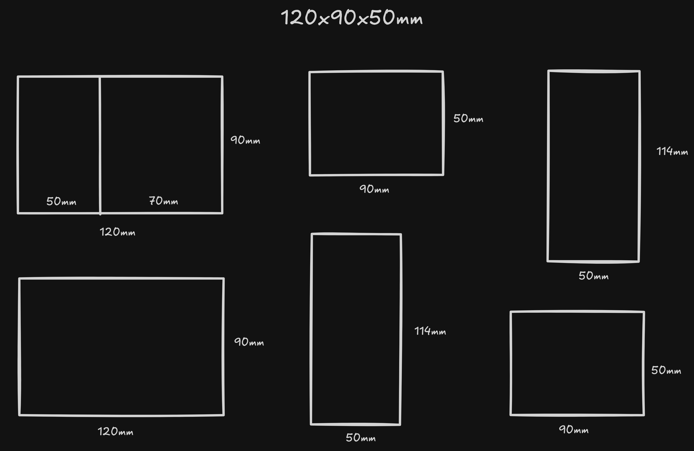

# 📦 The Emotional Useless Box
A useless box with diverse "personalities", controlled by an array of function pointers.

## 💡 Overview
This DIY Useless Box project utilizes a Push-Pull Linkage mechanism, allowing the lid to actively snap shut. Combined with randomized response scenarios, it creates various emotional states (Normal, Angry, Hesitant, etc.) for the box.

## ✨ Features
- Active lid mechanism using an independent servo.
- LED display for emotional status.
- Randomized emotional response system.

## 🛠️ Hardware Requirements
- 1x Microcontroller (Arduino NANO).
- 2x Micro Servo SG90.
- 1x MTS Toggle Switch (ON-OFF).
- 1x 18650 Li-ion Battery + TP4056 Charging Module.
- 1x Mini DC-DC Boost Converter (for Arduino).
- Case Material: 3mm Formex board (PVC foam board).

## 📐 Mechanical Blueprint

## 🚀 Installation & Setup
1. Clone this repository to your local machine.
2. Open the `.ino` file using Arduino IDE.
3. Ensure the built-in `Servo.h` library is included.
4. Upload the code to your Arduino.

## 🗺️ Roadmap (TODO)
- [x] Design Formex case dimensions (120x90x50mm).
- [ ] Assemble the push-pull linkage for the lid.
- [ ] Install RGB LED for emotional state indication.
- [ ] Implement the array of function pointers for randomized scenarios.